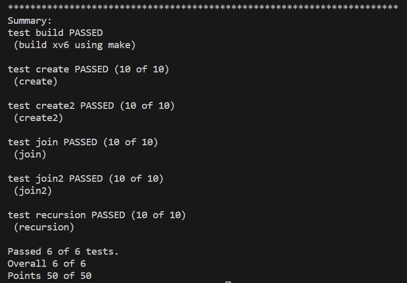
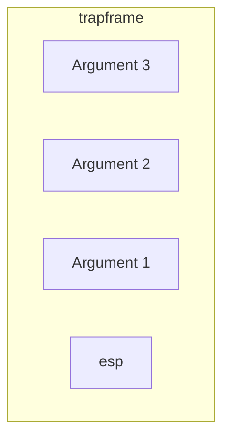

[](https://classroom.github.com/a/P8BtLxef)
# xv6 Threads



### Clone

`int  clone(void(*fcn)(void*), void *arg, void *stack)`

#### 提取用户空间传递的参数

`sysproc.c`

```c
int
sys_clone(void)
{
  //extract arguments from user space
  void (*fcn)(void*),*arg,*stack;
  
  if(argptr(0,(void*)&fcn,sizeof(fcn))<0||
     argptr(1,&arg,sizeof(arg))<0||
     argptr(2,&stack,sizeof(stack))<0)
     return -1;

  return clone(fcn,arg,stack);
}
```

这个函数是用户态调用`clone`系统调用与内核态实现线程创建的`clone`函数之间的桥梁。它提取了用户空间所需的参数，然后调用内核级函数执行实际的线程创建。

##### 深入`argptr`

```c
int argptr(int n, char **pp, int size)
{
  int i;
  
  if(argint(n, &i) < 0)
    return -1;
  if((uint)i >= proc->sz || (uint)i+size > proc->sz)
    return -1;
  *pp = (char*)i;
  return 0;
}
```

这个函数提取第n个系统调用参数，并通过检查该指针是否在用户空间中以转化为大小为size的指针。

##### 深入`argint`

```c
int argint(int n, int *ip)
{
  return fetchint(proc, proc->tf->esp + 4 + 4*n, ip);
}
```

这个函数提取第n个系统调用参数，并将其存储在ip指向的位置

- `proc->tf->esp`：是当前进程在用户态执行时栈的栈顶指针，`proc->tf->esp+4+4*n`计算出第n个参数在栈上的位置

##### 深入`fetchint`

```c
int
fetchint(struct proc *p, uint addr, int *ip)
{
  if(addr >= p->sz || addr+4 > p->sz)
    return -1;
  *ip = *(int*)(addr);
  return 0;
}
```

这个函数首先判断参数地址`addr`是否在进程`p`的地址空间内，然后从`addr`处提取一个整数，并将其存储在指针`ip`指向的位置



#### 在内核态中实现clone

- 分配一个新进程
- 将父进程的页目录（`pgdir`）、大小（`sz`）、父进程和陷阱帧（`tf`）分配给新创建的进程（`np`）实现新线程的地址空间与父进程共享。
- 将新线程的入口点设置为提供的函数`fcn`，栈指针`esp`初始化为指定的栈地址`stack`
- 将传递的参数`arg`压栈
- 将虚构的返回地址`0xffffffff`压栈
- 从父进程复制文件描述符`filedup`与当前工作目录`cwd`
- 设置进程状态`RUNNABLE`和详细信息`name`
- 返回新线程的`pid`

### Join

#### 提取用户空间传递的参数

`sysproc.c`

```c
int 
sys_join(void)
{
  void **stack;

  if(argptr(0,&stack,sizeof(stack))<0)
    return -1;
  
  return join(stack);
}
```

#### 在内核态中实现join

- 获取进程表的锁
- 循环扫描进程表，查找当前进程的子线程
- 如果找到了子线程，并且子线程的状态为`ZOMBIE`，则保存子线程的信息，释放相关资源，并返回子线程的`pid`
- 如果未找到子线程或者当前进程已被标记为`killed`，则释放锁并返回-1；否则调用`sleep`进入睡眠状态，等待其他进程唤醒，之后重复步骤2
- 在多线程进程中，当线程扩展地址空间时，有一点需要注意。仔细跟踪这条代码路径，看看哪里需要新锁，还有哪些地方需要更新，以便在多线程进程中正确扩展地址空间。

需要注意的是：

1. `join`等待的子线程应与父进程共享地址空间，`wait`等待的子进程不与父进程共享地址空间，而是拥有自己独立的地址空间。
2. 在`kernel/proc.c`的`growproc`函数中，在线程扩展地址空间时，需要为进程表加锁，防止多个线程同时对地址空间范围进行修改，造成地址空间增长不一致。

### Thread

#### thread_create

- 分配一页大小并与页对齐的用户栈
- 使用`clone`系统调用创建一个新的内核线程，将 `start_routine` 函数作为参数传递，该函数将由新线程执行，同时将 `arg` 作为参数传递给此函数。新分配的栈用作新线程的用户栈。
- 返回新线程的`pid`

#### thread_join

- 使用`join`系统调用等待子线程退出
- 释放用户栈
- 返回子线程的`pid`

#### Thread Library

- 在`user.h`中添加函数的声明

  ```c
  int thread_create(void (*start_routine)(void*), void *arg);
  int thread_join();
  ```

- 新建`uthread.c`，实现函数定义

  ```c
  //......
  #include "user.h"
  
  int 
  thread_create(void (*start_routine)(void*),void *arg){
    //......
    return pid;
  }
  
  int 
  thread_join(){
    //......
    return pid;
  }
  ```

- 在`user/makefile.mk`中新增用户库目标文件

  ```makefile
  # user library files
  USER_LIBS := \
  	ulib.o\
  	usys.o\
  	printf.o\
  	umalloc.o\
  	uthread.o
  ```

